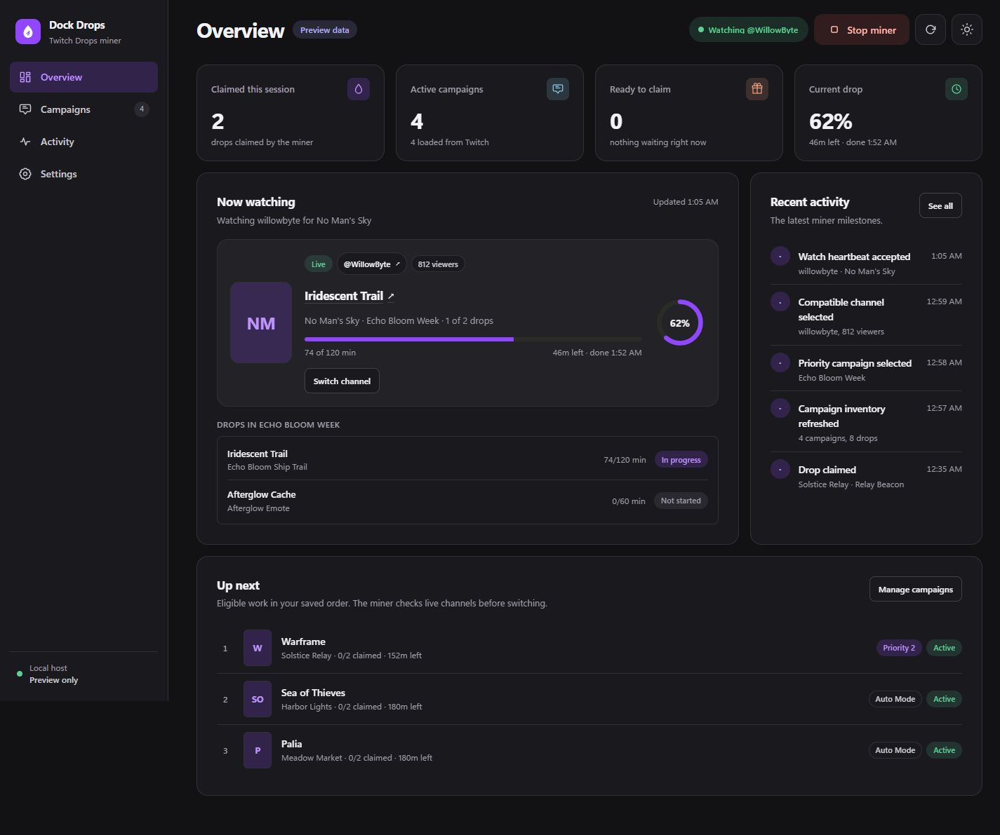

<div align="center">
  
  <h1>Twitch Dock Drops</h1>
  <p><strong>Set it once. Let your Drops grow.</strong></p>
  <p>
    A self-hosted Twitch Drops farmer with campaign tracking, channel failover, progress supervision,
    and automatic claiming from a single web dashboard.
  </p>
  <p>
    
    
    
    
  </p>
</div>



*Current dashboard with built-in preview data. Campaigns, rewards, and activity are illustrative.*

Twitch Dock Drops quietly farms timed Twitch Drops without playing or downloading the stream. Run it
in Docker, connect your Twitch account through the official device-activation page, choose the games
you care about, and leave the miner to handle the rest.

> [!IMPORTANT]
> Twitch Dock Drops is unofficial and is not affiliated with Twitch. Twitch can change its private
> Drops endpoints at any time.

## Why Twitch Dock Drops?

- **No stream playback:** earns timed progress without downloading video or audio.
- **Campaign tracking:** refreshes campaigns and keeps the inventory current.
- **Channel hunting and recovery:** finds compatible live channels and moves on when progress stalls.
- **Persistent game priorities:** save categories before their next campaign, set their order, and let
  Auto Mode find useful fallback work.
- **Automatic claiming:** attempts to claim completed Drops and retries temporary failures.
- **Pick up after restarts:** restores your encrypted login, preferences, priorities, and saved
  Start/Stop choice.
- **A real dashboard:** watch progress, browse campaigns, switch channels, and review activity from
  one UI.
- **Desktop and mobile friendly:** use the responsive dark or light dashboard from any trusted
  LAN device.
- **Built for Docker:** one hardened, non-root container with a read-only root filesystem and durable
  data volume.

## Quick start

You need [Docker](https://docs.docker.com/get-docker/) with Docker Compose and a Twitch account that
can participate in Drops campaigns.

```bash
git clone https://github.com/Mxlted/TwitchDockDrops.git
cd TwitchDockDrops
cp .env.example .env
docker compose up --build -d
```

On PowerShell, use `Copy-Item .env.example .env` instead of `cp`.

Then open:

- **This computer:** [http://127.0.0.1:8080](http://127.0.0.1:8080)
- **Another device on your LAN:** `http://<docker-host-lan-ip>:8080`

The supplied `.env.example` enables trusted-LAN access. Anyone on that LAN who can reach the port can
control the miner, so use it only on a private network and never port-forward it to the internet. See
the [Operator Guide](./OPERATIONS.md#network-access) for loopback-only and reverse-proxy setups.

## Start farming in three steps

1. Select **Connect Twitch** in the dashboard.
2. Approve the displayed code on Twitch's device-activation page. The app never asks for your Twitch
   password.
3. Choose game priorities or leave Auto Mode in charge, then start the miner.

Twitch Dock Drops refreshes your campaigns, chooses an eligible live channel, reports watch progress,
recovers from stalled channels, and claims completed Drops. Your saved session is restored after a
container restart, and the miner resumes automatically if it was running before the restart, so normal
day-to-day use is simply opening the dashboard when you want to check in.

## The dashboard

The interface is a flat, Twitch-purple dashboard that keeps the important parts close:

- **Header** shows the miner state on every page with Start/Stop, refresh, and theme controls.
- **Overview** shows session stats, the current Drop with progress and an estimated finish time,
  every drop in the active campaign, recent activity, and the server-ranked **Up next** queue.
- **Campaigns** lets you search, filter, and sort active or upcoming campaigns, expand their drops and
  rewards, check end dates, open account-link pages, and exclude campaigns. Lists use 24-row pages.
- **Game & category priorities** saves favorites even without a current campaign. Add an exact Twitch
  category name, reorder with arrows or a rank number, and keep its place when a new campaign returns.
  **All Twitch categories** searches Twitch on demand, including games without Drops campaigns or
  a connected account. Enter at least two characters and select **Search Twitch**, then **+ Add**.
  Two- or three-character searches show up to 12 results. Four or more characters unlock all matches
  available from Twitch through **Previous/Next**, 50 per page. Pages load only on request and are
  cached for five minutes. You can also search loaded/saved categories or narrow to active or linked
  campaigns.
- **Activity** explains what the miner selected, refreshed, watched, or claimed, above the runtime log.
- **Settings** controls timing, Auto Mode order, fallback behavior, and resets, and reports the
  service version, uptime, and Twitch connection.
- **Switch channel** opens a compatible live-channel picker. The current channel keeps running until
  you select an alternative.
- Views are bookmarkable (`/#campaigns`), and an offline banner appears if the local host stops
  responding.

The miner keeps lifecycle work on the server. Closing the browser does not stop farming.
**Up next** follows your saved priorities, exclusions, campaign eligibility, and fallback order;
live-channel availability determines what can actually run.

To explore without connecting Twitch, select **Explore with preview data** on the welcome screen
or open `/?preview=active` on your instance. Preview controls do not change the miner.

## Good to know

- Your Twitch account must be eligible for the campaign, and some rewards require linking the related
  game account.
- Avoid manually watching Twitch on the same account while mining; simultaneous viewing can confuse
  progress reporting.
- Unlinked-campaign farming is optional and treated as speculative until Twitch confirms real progress.
- Private Twitch behavior can change, so review the [Project Status](./PROJECT_STATUS.md) when troubleshooting.
- Local activity logs can contain campaign and channel names; review them before sharing.

## Documentation

- [Operator Guide](./OPERATIONS.md): deployment, networking, environment variables, data, and commands
- [Security](./SECURITY.md): session storage, browser protections, and safe exposure
- [Architecture](./ARCHITECTURE.md): runtime, API, scheduling, and Twitch integration details
- [Project Status](./PROJECT_STATUS.md): completed work, verification history, and known limitations
- [Android companion project](https://github.com/Mxlted/TwitchDropsMinerAndroid): the separate mobile edition

## Credits

Twitch Dock Drops is an independent project inspired by the Twitch Drops mining community, including
[rangermix/TwitchDropsMiner](https://github.com/rangermix/TwitchDropsMiner) and the original
[DevilXD/TwitchDropsMiner](https://github.com/DevilXD/TwitchDropsMiner). The separate
[TwitchDropsMinerAndroid](https://github.com/Mxlted/TwitchDropsMinerAndroid) project serves as a
behavioral reference for this JVM/web edition.

## License

Twitch Dock Drops is available under the [MIT License](./LICENSE).
